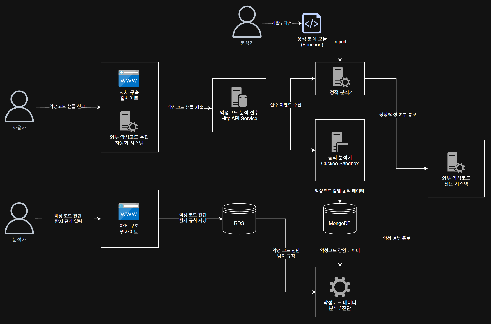

## 악성코드 분석/진단 자동화 시스템 구축

세계적으로 하루에만 수만~수십만 개의 악성 코드가 생성됩니다. 일부는 제작자가 직접 개발한 것이지만, 많은 경우 블랙 마켓에서 유통되는 라이브러리나 도구(예: packer, polymorphic engine)를 활용해 자동 생성됩니다. 이들은 같은 동작을 수행하면서도 서로 다른 형태로 위장하여 Anti-Virus 엔진의 탐지를 회피합니다.

그러나 동일한 라이브러리를 기반으로 만들어진 악성 코드는 감염 후 유사한 동작 패턴을 보입니다. 이 점에 착안하여, 팀 내에서 **악성코드 자동 분석 및 분류 시스템**을 설계·개발했습니다.

---

#### 시스템 구성 및 자동화 흐름

1. **샘플 수집 (HTTP API 기반 Intake 시스템)**

   - 자체 구축한 Django 기반 웹 사이트 및 외부 연동 시스템을 통해 하루 약 2,000건의 악성코드 샘플을 수집합니다.
   - 수집된 파일은 스토리지에 저장되고, 이벤트를 발행하여 후속 분석 작업을 트리거합니다.

2. **정적 분석 플랫폼**

   - 정적 분석으로 일부 악성코드를 빠르게 식별할 수 있도록, 분석 함수 모듈을 쉽게 추가·관리 가능한 구조로 구현했습니다.
   - 분석가는 필요한 룰을 함수로 작성해 시스템에 추가할 수 있으며, 플랫폼은 자동으로 접수된 파일에 대해 분석을 수행합니다.

3. **동적 분석 (Cuckoo Sandbox 기반)**

   - 악성코드 샘플은 사전에 구성된 Windows 가상 머신에서 실행되며, 각 샘플은 지정된 Snapshot 환경에서 복원 후 분석됩니다.
   - Cuckoo Sandbox를 활용해 샘플을 실행하고, 시스템 호출, 파일 변경, 네트워크 통신 등 행동 로그를 수집합니다.

4. **진단 및 분류 자동화**

   - 수집된 동작 데이터를 기반으로 분석가가 정의한 룰과 매칭하여 악성 여부를 판단합니다.
   - 진단 결과는 외부 보안 시스템에 자동 보고되며, 자체 웹 UI를 통해 분석 결과 조회 및 룰 관리를 지원합니다.

---

#### 시스템 구성도

---

#### 자동화 도입 후 주요 개선점

- **빠른 초기 진단**: 정적 분석 플랫폼을 통해 일부 악성코드를 신속하게 판단할 수 있게 되었습니다.
- **패턴 기반 진단 자동화**: 반복적인 악성코드 유형은 분석가의 개입 없이 자동 진단이 가능해졌습니다.
- **분류 효율성 향상**: 룰 기반 분류 체계를 통해 대량의 샘플을 일관성 있게 처리할 수 있게 되었습니다.
