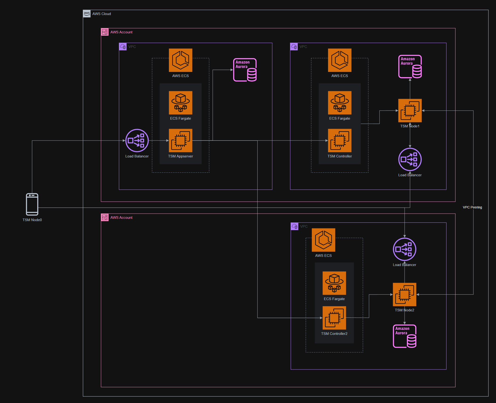

### TSM 인프라 구축 자동화

이 프로젝트의 목표는 다수 계정으로 구성된 AWS 리소스를 자동으로 구성해, **TSM(Threshold Signature Module)** 인프라 환경을 손쉽게 재현할 수 있도록 하는 것입니다.

[TSM](https://builder-vault-tsm.docs.blockdaemon.com/docs/what-is-builder-vault-tsm)은 블록체인 암호화 키의 안전한 생성, 저장 및 사용을 위해 설계된 [Blockdaemon](https://www.blockdaemon.com/) 사의 임계 보안 모듈입니다. 다자간 계산(MPC) 기술을 활용하여, 각 노드가 개인 키의 일부를 생성하고 이를 안전하게 저장함으로써 전체 키 보안을 강화합니다. 이를 통해 민감한 키가 단일 관리자나 단일 조직의 통제 하에 놓이지 않도록 하여 보안성을 높입니다.

보통 Bitcoin Native Segwit 방식의 ECDSA 서명을 수행할 때에는 하나의 Private Key가 필요합니다. 그러나 TSM은 이를 분산해 관리하고, 서명에 필요한 최소한의 정보(ECDSA Sign)만 생성하여 사용함으로써 키 유출 가능성을 줄입니다.

다자간 계산(MPC)을 구동하기 위해서는 P2P 통신이 가능한 다수의 Node 가 필요합니다. Node 는 Server 일 수도 있고, 사용자의 스마트폰 또는 Browser 가 될 수도 있습니다.

TSM 인프라를 자동으로 구성하기 위해 **AWS CloudFormation**을 활용했습니다.
아래 이미지는 본 프로젝트에서 CloudFormation 으로 구성한 TSM infra 구조를 보여줍니다.

CloudFormation Stack 은 `KMS Stack`과 `Core Stack` 두 개로 나뉘며, 아래는 각 Stack 에 포함된 리소스와 설명입니다.

#### ✅ KMS Stack

Core Stack 을 배포하기 전에 KMS Stack 을 먼저 배포해야 합니다.
KMS Stack 이 배포되면 TSM 에서 사용할 KMS 키와 각 Node 의 API Key, 다자(TSM Node) 간 암호화 P2P 통신에 사용할 Private Key 가 생성되어 Secrets Manager, Parameter Store 에 저장됩니다.

- **KMS Key**: 민감 정보 암호화
- **SSM Parameter Store**: 노드의 환경 변수 저장
- **Secrets Manager**: 노드별 고유 API Key 및 Private Key 저장
- **Resource Access Manager**: 다계정 간 리소스 공유 설정
- **Lambda Function**: 초기 API Key 및 Private Key를 관리자 개입 없이 자동 생성
- **IAM Role / Policy / Security Group**: 각 리소스에 대한 접근 권한 설정

#### ✅ Core Stack

KMS Stack 의 Output 데이터를 활용해서 Core Stack 을 구축합니다.
키를 저장할 Database, 계산을 수행할 EC2, Load Balancer 등을 생성합니다.
네트워크 격리에 필요한 VPC 를 생성하고 보안그룹을 설정합니다.
Hosted Zone 을 입력받아 DNS Record 를 자동으로 생성합니다.

- **VPC**
  - Public / Private Subnet
  - NAT Gateway
- **Network Load Balancer**
- **Route 53**
  - DNS Record
  - SSL 인증서
- **RDS** : 키 조각을 저장하는 Database
- **EC2 Instance** : 다자간 계산을 실행하는 Compute
- **IAM Instance Profile** : 특정 리소스에 접근할 권한을 EC2 에 부여
- **Cloud Map**: 서비스 디스커버리 설정
- **IAM Role / Policy / Security Group**

**자동화 도입 후 개선점**

- **재현성**: 모든 리소스를 빠르고 정확하게 반복 구성할 수 있어, 개발/테스트/운영 환경 간의 일관성을 확보했습니다.
- **보안성 향상**: 엔지니어가 직접 민감 정보를 다루지 않도록 하여 키 유출 가능성을 원천 차단했습니다.
- **인적 오류 최소화**: 수작업 구성에서 발생할 수 있는 누락, 오입력, 권한 설정 오류 등을 방지했습니다.
- **운영 효율성 향상**: 인프라를 코드로 관리(IaC)함으로써 변경 이력 추적 및 협업이 쉬워졌고, 다계정 환경에서도 관리가 간편해졌습니다.
